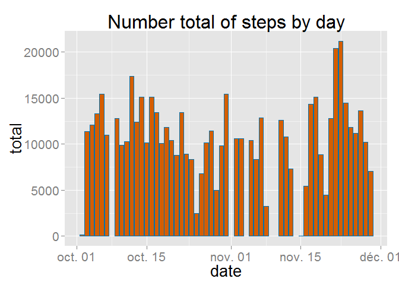
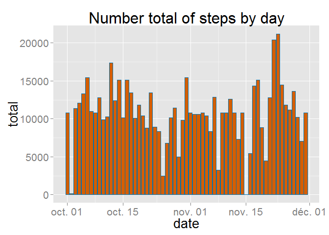

# Reproducible Research: Peer Assessment 1

## Loading and preprocessing the data

1. Load the data

To load the data, we use the read.csv() command and have a look to the data


```r
setwd("C:/Users/Roro7_000/Documents/MOOC/Reproducible research/Project1/RepData_PeerAssessment1/activity")

activity<-read.csv('activity.csv',stringsAsFactors=F)
dfActivity<-as.data.frame(activity)
str(dfActivity)
```

```
## 'data.frame':	17568 obs. of  3 variables:
##  $ steps   : int  NA NA NA NA NA NA NA NA NA NA ...
##  $ date    : chr  "2012-10-01" "2012-10-01" "2012-10-01" "2012-10-01" ...
##  $ interval: int  0 5 10 15 20 25 30 35 40 45 ...
```


## What is mean total number of steps taken per day?

1.Calculate the total number of steps taken per day

We remove row with NA in the data frame thanks to the complete.cases command.


```r
dfActivityClean<-dfActivity[complete.cases(dfActivity),]
head(dfActivityClean)
```

```
##     steps       date interval
## 289     0 2012-10-02        0
## 290     0 2012-10-02        5
## 291     0 2012-10-02       10
## 292     0 2012-10-02       15
## 293     0 2012-10-02       20
## 294     0 2012-10-02       25
```

We use the plyr packages to sum the number of steps by date.

```r
dfActivityClean$date <- as.Date(format(dfActivityClean$date, format="%Y-%m-%d"))
library(plyr)
totalStepsByDay<-ddply(dfActivityClean, .(date), summarize, total=sum(steps))
totalStepsByDay$total<-as.numeric(totalStepsByDay$total)
totalStepsByDay$date<-as.Date(totalStepsByDay$date)
totalStepsByDay$Source<-'NOT NA'
head(totalStepsByDay)
```

```
##         date total Source
## 1 2012-10-02   126 NOT NA
## 2 2012-10-03 11352 NOT NA
## 3 2012-10-04 12116 NOT NA
## 4 2012-10-05 13294 NOT NA
## 5 2012-10-06 15420 NOT NA
## 6 2012-10-07 11015 NOT NA
```

2. Histogram of the total number of steps taken each day


```r
library(ggplot2)
ggplot(data=totalStepsByDay, aes(x = date, y =total)) + geom_histogram(stat = "identity") + theme(text = element_text(size=20), axis.text.x = element_text(angle=90, vjust=1))
```

 

3.  The mean and median of the total number of steps taken per day


```r
ddply(dfActivityClean, .(date), summarize, total=sum(steps),mean=mean(steps),median=median(steps))
```

```
##          date total       mean median
## 1  2012-10-02   126  0.4375000      0
## 2  2012-10-03 11352 39.4166667      0
## 3  2012-10-04 12116 42.0694444      0
## 4  2012-10-05 13294 46.1597222      0
## 5  2012-10-06 15420 53.5416667      0
## 6  2012-10-07 11015 38.2465278      0
## 7  2012-10-09 12811 44.4826389      0
## 8  2012-10-10  9900 34.3750000      0
## 9  2012-10-11 10304 35.7777778      0
## 10 2012-10-12 17382 60.3541667      0
## 11 2012-10-13 12426 43.1458333      0
## 12 2012-10-14 15098 52.4236111      0
## 13 2012-10-15 10139 35.2048611      0
## 14 2012-10-16 15084 52.3750000      0
## 15 2012-10-17 13452 46.7083333      0
## 16 2012-10-18 10056 34.9166667      0
## 17 2012-10-19 11829 41.0729167      0
## 18 2012-10-20 10395 36.0937500      0
## 19 2012-10-21  8821 30.6284722      0
## 20 2012-10-22 13460 46.7361111      0
## 21 2012-10-23  8918 30.9652778      0
## 22 2012-10-24  8355 29.0104167      0
## 23 2012-10-25  2492  8.6527778      0
## 24 2012-10-26  6778 23.5347222      0
## 25 2012-10-27 10119 35.1354167      0
## 26 2012-10-28 11458 39.7847222      0
## 27 2012-10-29  5018 17.4236111      0
## 28 2012-10-30  9819 34.0937500      0
## 29 2012-10-31 15414 53.5208333      0
## 30 2012-11-02 10600 36.8055556      0
## 31 2012-11-03 10571 36.7048611      0
## 32 2012-11-05 10439 36.2465278      0
## 33 2012-11-06  8334 28.9375000      0
## 34 2012-11-07 12883 44.7326389      0
## 35 2012-11-08  3219 11.1770833      0
## 36 2012-11-11 12608 43.7777778      0
## 37 2012-11-12 10765 37.3784722      0
## 38 2012-11-13  7336 25.4722222      0
## 39 2012-11-15    41  0.1423611      0
## 40 2012-11-16  5441 18.8923611      0
## 41 2012-11-17 14339 49.7881944      0
## 42 2012-11-18 15110 52.4652778      0
## 43 2012-11-19  8841 30.6979167      0
## 44 2012-11-20  4472 15.5277778      0
## 45 2012-11-21 12787 44.3993056      0
## 46 2012-11-22 20427 70.9270833      0
## 47 2012-11-23 21194 73.5902778      0
## 48 2012-11-24 14478 50.2708333      0
## 49 2012-11-25 11834 41.0902778      0
## 50 2012-11-26 11162 38.7569444      0
## 51 2012-11-27 13646 47.3819444      0
## 52 2012-11-28 10183 35.3576389      0
## 53 2012-11-29  7047 24.4687500      0
```


## What is the average daily activity pattern?

1. Average number of steps in function of interval

```r
averageStepsByinterval<-ddply(dfActivityClean, .(interval), summarize, mean=mean(steps))

maxMeanStep<-max(averageStepsByinterval$mean)
invervalWithMaxStep<-averageStepsByinterval[averageStepsByinterval$mean==maxMeanStep,]$interval

ggplot(data=averageStepsByinterval, aes(x = interval, y =mean)) +  geom_line()+geom_point(data = averageStepsByinterval, aes(x=invervalWithMaxStep, max(mean)), col = 'darkblue',size=5) + geom_text(data = averageStepsByinterval, aes(x=invervalWithMaxStep+250, max(mean), label = "Maximum"),colour='darkblue')
```

 
 
 2.

The 5-minute interval, on average across all the days in the dataset, which contains the maximum number of steps is 835 interval.

## Imputing missing values

1. Calculate and report the total number of missing values in the dataset


The number of row before remove Na is 17568 and after : 15264
So the difference is 2304

2. Strategy to replace missing value

Now, we are going to fill the missing values in the Steps column.
We search which column contains missing values


```r
na_count <-sapply(dfActivity, function(y) sum(length(which(is.na(y)))))
print(na_count,type="html")
```

```
##    steps     date interval 
##     2304        0        0
```
And with the above table, we can see only we have to fill in the steps column.
Now we use the mean of each day to fill in the Nas. That's why we use the averageStepsByinterval data set in the third session. 


```r
for(j in 1:nrow(dfActivity)){
  if(is.na(dfActivity[j,]$steps)){
    #we look at the averageStepsByinterval dataframe to match with the coresponding interval value
    dfActivity[j,]$steps<-averageStepsByinterval[averageStepsByinterval$interval==dfActivity[j,]$interval,]$mean
  }
}
```

3. The new data set


```r
head(dfActivity)
```

```
##       steps       date interval
## 1 1.7169811 2012-10-01        0
## 2 0.3396226 2012-10-01        5
## 3 0.1320755 2012-10-01       10
## 4 0.1509434 2012-10-01       15
## 5 0.0754717 2012-10-01       20
## 6 2.0943396 2012-10-01       25
```


4. Total number of steps taken each day

This is the plot and the mean and median total number of steps taken per day with replacing missing value:


```r
totalStepsByDayWithNa<-ddply(dfActivity, .(date), summarize, total=sum(steps))
totalStepsByDayWithNa$total<-as.numeric(totalStepsByDayWithNa$total)
totalStepsByDayWithNa$date<-as.Date(totalStepsByDayWithNa$date)
totalStepsByDayWithNa$Source<-'NA'

ggplot(data=totalStepsByDayWithNa, aes(x = factor(date), y =total)) + geom_histogram(stat = "identity")
```

 

```r
ddply(dfActivity, .(date), summarize, total=sum(steps),mean=mean(steps),median=median(steps))
```

```
##          date    total       mean   median
## 1  2012-10-01 10766.19 37.3825996 34.11321
## 2  2012-10-02   126.00  0.4375000  0.00000
## 3  2012-10-03 11352.00 39.4166667  0.00000
## 4  2012-10-04 12116.00 42.0694444  0.00000
## 5  2012-10-05 13294.00 46.1597222  0.00000
## 6  2012-10-06 15420.00 53.5416667  0.00000
## 7  2012-10-07 11015.00 38.2465278  0.00000
## 8  2012-10-08 10766.19 37.3825996 34.11321
## 9  2012-10-09 12811.00 44.4826389  0.00000
## 10 2012-10-10  9900.00 34.3750000  0.00000
## 11 2012-10-11 10304.00 35.7777778  0.00000
## 12 2012-10-12 17382.00 60.3541667  0.00000
## 13 2012-10-13 12426.00 43.1458333  0.00000
## 14 2012-10-14 15098.00 52.4236111  0.00000
## 15 2012-10-15 10139.00 35.2048611  0.00000
## 16 2012-10-16 15084.00 52.3750000  0.00000
## 17 2012-10-17 13452.00 46.7083333  0.00000
## 18 2012-10-18 10056.00 34.9166667  0.00000
## 19 2012-10-19 11829.00 41.0729167  0.00000
## 20 2012-10-20 10395.00 36.0937500  0.00000
## 21 2012-10-21  8821.00 30.6284722  0.00000
## 22 2012-10-22 13460.00 46.7361111  0.00000
## 23 2012-10-23  8918.00 30.9652778  0.00000
## 24 2012-10-24  8355.00 29.0104167  0.00000
## 25 2012-10-25  2492.00  8.6527778  0.00000
## 26 2012-10-26  6778.00 23.5347222  0.00000
## 27 2012-10-27 10119.00 35.1354167  0.00000
## 28 2012-10-28 11458.00 39.7847222  0.00000
## 29 2012-10-29  5018.00 17.4236111  0.00000
## 30 2012-10-30  9819.00 34.0937500  0.00000
## 31 2012-10-31 15414.00 53.5208333  0.00000
## 32 2012-11-01 10766.19 37.3825996 34.11321
## 33 2012-11-02 10600.00 36.8055556  0.00000
## 34 2012-11-03 10571.00 36.7048611  0.00000
## 35 2012-11-04 10766.19 37.3825996 34.11321
## 36 2012-11-05 10439.00 36.2465278  0.00000
## 37 2012-11-06  8334.00 28.9375000  0.00000
## 38 2012-11-07 12883.00 44.7326389  0.00000
## 39 2012-11-08  3219.00 11.1770833  0.00000
## 40 2012-11-09 10766.19 37.3825996 34.11321
## 41 2012-11-10 10766.19 37.3825996 34.11321
## 42 2012-11-11 12608.00 43.7777778  0.00000
## 43 2012-11-12 10765.00 37.3784722  0.00000
## 44 2012-11-13  7336.00 25.4722222  0.00000
## 45 2012-11-14 10766.19 37.3825996 34.11321
## 46 2012-11-15    41.00  0.1423611  0.00000
## 47 2012-11-16  5441.00 18.8923611  0.00000
## 48 2012-11-17 14339.00 49.7881944  0.00000
## 49 2012-11-18 15110.00 52.4652778  0.00000
## 50 2012-11-19  8841.00 30.6979167  0.00000
## 51 2012-11-20  4472.00 15.5277778  0.00000
## 52 2012-11-21 12787.00 44.3993056  0.00000
## 53 2012-11-22 20427.00 70.9270833  0.00000
## 54 2012-11-23 21194.00 73.5902778  0.00000
## 55 2012-11-24 14478.00 50.2708333  0.00000
## 56 2012-11-25 11834.00 41.0902778  0.00000
## 57 2012-11-26 11162.00 38.7569444  0.00000
## 58 2012-11-27 13646.00 47.3819444  0.00000
## 59 2012-11-28 10183.00 35.3576389  0.00000
## 60 2012-11-29  7047.00 24.4687500  0.00000
## 61 2012-11-30 10766.19 37.3825996 34.11321
```

Do these values differ from the estimates from the first part of the assignment?


```r
dataMerged<-rbind(totalStepsByDayWithNa,totalStepsByDay)
ggplot(data=dataMerged, aes(x = date, y =total,fill=Source)) + geom_histogram(stat = "identity",binwidth=1, position="dodge")
```

 

If we compare this two histograms we can this is the ame, except for the missing value (the red larger rectangles)

And the difference id about the median for each day (0 when we don't replace NA and differente from 0 from some date with the new data set)

## Are there differences in activity patterns between weekdays and weekends?

1. Creation new vector

We use apply to scan all the data set and completed a new column "day" with "weekday" or "weekend"

```r
dfActivity[,"day"] <-apply(dfActivity, 1, function(x) if(weekdays(as.Date(x[2])) %in% c("lundi","mardi","mercredi","jeudi","vendredi")){ "weekday"}else{"weekend"})
```

We plot he average number of steps taken per type of day:


```r
final<-ddply(dfActivity, .(interval,day), summarize, mean=mean(steps))

ggplot(data=final, aes(x = interval, y =mean)) +  geom_line()  + facet_wrap(~ day)+
    theme(text = element_text(size=20),
        axis.text.x = element_text(angle=90, vjust=1))
```

 
